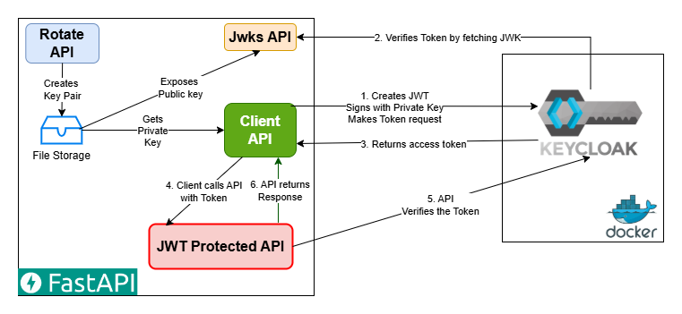

# Private Key JWT Authentication for Enterprise Security

In this project, we implement the OIDC `Private Key JWT` for System To System Authentication.  The Private Key JWT authentication method enhances OAuth 2.0 security by requiring clients to generate a signed JSON Web Token (JWT) using an asymmetric private key.  This approach eliminates the need to store or transmit client secrets, dramatically reducing the risk of credential exposure, and aligns with high security requirements for the [Financial-grade API (FAPI)](https://openid.net/specs/fapi-security-profile-2_0-final.html) Security Profile defined by the OpenID Foundation.

[Read the Medium article on this topic.](https://medium.com/@smislam_53676/level-up-your-api-security-with-private-key-jwt-75f12297b605)

This example uses [RFC 7521 - Assertion Framework](https://www.rfc-editor.org/rfc/rfc7521.html) and [RFC 7523 - JWT Profile for Client Authentication](https://www.rfc-editor.org/rfc/rfc7523.html) implementation.

> *If you are still using `Client_Credentials` grant flow, please see my Github project on how you can [Securly Shrare Secrets](https://github.com/smislam/securely-share-secrets).*

## Problems with Traditional Client Authentication

- Uses Client_Credentials grant flows
- API provider shares Secrets with Client
- Client sends Secrets to Auth Server
- Secrets Transmitted over network
- Secrets Stored in multiple places
- No Secret Rotation or is complex
- No non-repudiation

### Security Vulnerabilities in Traditional Approach
- **Secret Exposure**: Client secrets in logs, configuration files, memory dumps
- **Credential Stuffing**: Compromised secrets used across multiple systems  
- **Rotation Complexity**: Coordinated updates across distributed systems
- **Network Interception**: Secrets transmitted in requests

## Why Private Key JWT authentication?

- Enhanced Security using RFC 7521/7523 to enhance OAuth 2.0 security
- No shared secrets
- Cryptographic proof
- Stateless verification
- Non-repudiation

### RFC 7521: JWT Assertions for OAuth 2.0
- Defines how JWTs can be used as authorization grants
- Establishes client assertion framework
- Security considerations for JWT-based authentication

### RFC 7523: JWT Profile for Client Authentication  
- Specific implementation for `private_key_jwt`
- JWKS integration requirements
- Signature algorithm specifications

## Private Key JWT Architecture

## Sequence Diagram (How do we do it?) 

# Steps to run and test
 * Run KeyCloak on Docker Desktop:
 
     `docker run -p 127.0.0.1:8080:8080 -e KC_BOOTSTRAP_ADMIN_USERNAME=admin -e KC_BOOTSTRAP_ADMIN_PASSWORD=admin quay.io/keycloak/keycloak:26.3.2 start-dev`
     * Keycloak : http://localhost:8080/
* Setup Keycloak
    * login as admin/admin
    
    * Create Client
    
    * Add Client Capability    
    
    * Setup JWKS.  Use the Client's JWKS URL.  Make sure you use `http://host.docker.internal:8000/jwks` URL.  This is becasue we are making host call from Docker.
    
    * Setup Private Key JWT and Algorithm.  KeyCloak calls this Signed JWT.  Click Save
    
    * Accept the change
    
    * Click on Client Scope Menu on left and Create Client Scope
    
    * On the Mappers tab, Map Client Audience
    
    * Click to add a new Audience.  Click Save.
    
    * Go back to Client.  Add the Scope
    
    * Attach the scope to the client.
        

* Setup virtual environment and install requirements.
* Start the Python FastAPI server that hosts:

    `fastapi dev main.py --host 0.0.0.0 --port 8000`
    * Use the Swagger UI on http://localhost:8000/docs
    * APIs 
        * Keypair Rotation API
        * JWKS endpoint API
        * Client API
        * JWT Protected API integrated with KeyCloak
* Create the Keypairs by clicking on `rotate`, or http://localhost:8000/rotate
* Check if the JWKS endpoint Works. Click on `JWKS`, or http://localhost:8000/jwks
* If keycloak is already configured for `private_key_jwt`, then click on the client api, or http://localhost:8000/client
    * You should get a successful response:
     
---

# References
- [KeyCloak](https://www.keycloak.org/)
- [FastAPI](https://fastapi.tiangolo.com/)
- [Financial-grade API (FAPI) spec](https://openid.net/specs/fapi-security-profile-2_0-final.html)
- [RFC 7521 - Assertion Framework](https://www.rfc-editor.org/rfc/rfc7521.html)
- [RFC 7523 - JWT Profile for Client Authentication](https://www.rfc-editor.org/rfc/rfc7523.html)